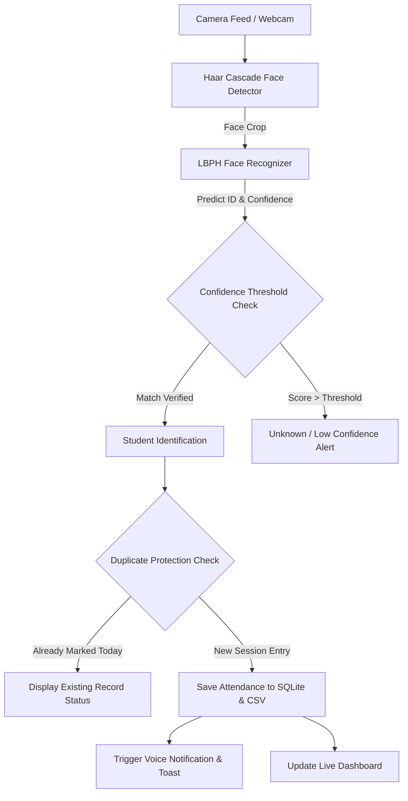
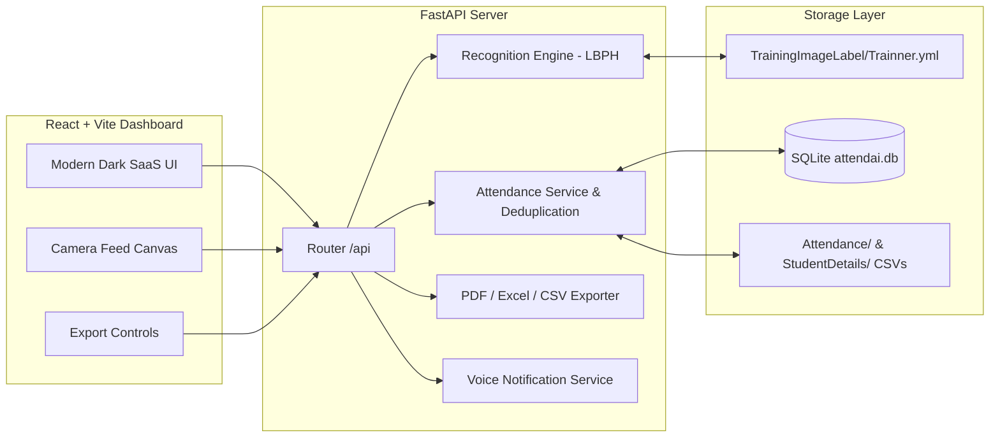

# AttendAI

**Smart Face Recognition Attendance System**

[](https://www.python.org/)
[](https://fastapi.tiangolo.com/)
[](https://reactjs.org/)
[](https://tailwindcss.com/)
[](https://opencv.org/)

---

## Overview

**AttendAI** is a modern, production-grade AI-powered Attendance Management System. Built upon OpenCV's Local Binary Patterns Histograms (LBPH) face recognition engine and Haar Cascade object detection, AttendAI transforms legacy desktop attendance workflows into a sleek, responsive dashboard application.

It features live face recognition, automatic attendance marking with session deduplication, 50-sample student registration wizard, model retrain management, student profiles, analytics charts, manual attendance override, exportable CSV/Excel/PDF reports, and text-to-speech voice alerts.

---

## Architecture & Workflows

### Face Recognition Flow



### System Architecture



---

## Key Features

- **Production SaaS Dashboard**: Real-time metric cards for Total Students, Present Today, Absent Today, Attendance Rate %, Active Subjects, and Last Recognition event.
- **Live Face Recognition**: Real-time camera feed overlay displaying face bounding boxes, recognized student name, enrollment ID, confidence score, and status badges (`Scanning`, `Face Detected`, `Recognized`, `Attendance Marked ✓`, `Unknown`, `Low Confidence`).
- **Student Registration Wizard**: 4-step wizard capturing up to 50 cropped face sample images per student (`TrainingImage/Enrollment_Name/`) with real-time positioning guides and progress bar.
- **LBPH Model Training**: Interactive dashboard to view model status, registered student count, sample dataset metrics, and trigger model retrains (`TrainingImageLabel/Trainner.yml`).
- **Duplicate Attendance Protection**: Automatic deduplication ensuring students are marked present once per subject session per day.
- **Student Profiles**: Comprehensive modal displaying student details, face sample count, attendance rate %, present/absent stats, and full attendance log.
- **Manual Attendance**: Subject chooser, date picker, student lookup, bulk present/absent toggles, and record save.
- **Formatted Reports**: Instant exports in **CSV**, **Excel (.xlsx)** with auto-adjusted column width and styled headers, and printable **PDF** documents generated via ReportLab.
- **Text-to-Speech (TTS)**: Voice notifications alerting when attendance is recorded or student is registered, with a global ON/OFF toggle.
- **Configurable Settings**: Adjustable LBPH confidence threshold (default: 70), camera source selection, session timeout, and voice preferences.

---

## Technology Stack

- **Frontend**: React 18, Vite, Tailwind CSS, Lucide Icons, Recharts.
- **Backend**: Python 3.9+, FastAPI, Uvicorn, SQLite3, Pandas, NumPy, OpenCV (`opencv-contrib-python`), PIL, OpenPyXL, ReportLab, Pyttsx3.

---

## Installation & Setup

### Prerequisites

- Python 3.9 or higher
- Node.js v18+ and npm

### 1. Backend Setup

Install Python dependencies:

```bash
pip install -r requirements.txt
```

### 2. Frontend Setup

Install Node packages and build the frontend bundle:

```bash
npm install --prefix frontend
npm run build --prefix frontend
```

---

## Running AttendAI Locally

### Option A: Running Production Build (Single Server)

Start the FastAPI server on port 8008. The server automatically serves the compiled frontend assets from `frontend/dist`:

```bash
python -m uvicorn backend.app.main:app --port 8008 --reload
```

Open your browser and navigate to: `http://127.0.0.1:8008`

### Option B: Running Development Servers (Hot Reloading)

1. Start the FastAPI backend:
   ```bash
   python -m uvicorn backend.app.main:app --port 8008 --reload
   ```

2. In a second terminal, start the Vite development server:
   ```bash
   npm run dev --prefix frontend
   ```

Open your browser and navigate to: `http://localhost:3000`

---

## Testing

Run the automated backend test suite covering API endpoints, student registration, attendance deduplication, and report generation:

```bash
python -m pytest backend/tests/test_api.py
```

Run basic API health verification:

```bash
python test.py
```

---

## Deployment Strategy

### Local Network Deployment (Recommended for Biometric Cameras)

Because OpenCV face recognition relies on direct camera hardware access or browser webcam streams, the recommended deployment architecture is **Local Area Network (LAN) Server Mode**:

1. Host the FastAPI backend and built frontend on a local campus/office workstation server.
2. Clients (laptops, tablets, desktop terminals) connect to the local IP address over LAN (e.g., `http://192.168.1.100:8008`).
3. Browser webcam permissions enable users to scan faces remotely, while the server processes frames using the local LBPH model.

### Cloud Deployment (Vercel + Railway / Render)

If deploying to cloud environments:
- **Frontend**: Deploy `frontend/` to Vercel or Netlify.
- **Backend**: Deploy `backend/` to Render, Railway, or AWS EC2 with persistent volume mounts for SQLite (`attendai.db`) and model artifacts (`TrainingImageLabel/`).
- Ensure HTTPS is configured so browsers grant webcam stream permissions to the frontend client.

---

## Biometric Privacy & Data Protection

- Raw student face image datasets (`TrainingImage/`) and trained model binary files (`TrainingImageLabel/Trainner.yml`) are strictly kept local to the server and are excluded from git version control via `.gitignore`.
- Student face images are processed into grayscale numeric histograms and are never publicly exposed through API endpoints.

---

## License

This project incorporates OpenCV Haar Cascade classifiers which carry their respective BSD licenses. Refer to `haarcascade_frontalface_default.xml` for licensing details.
